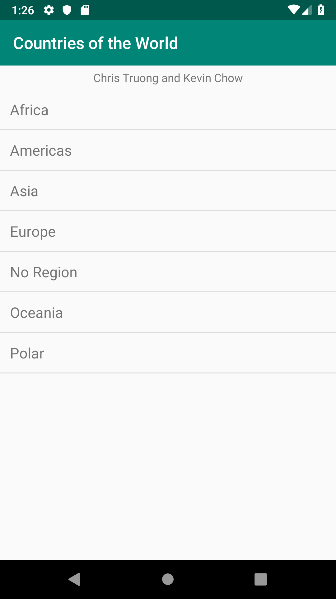
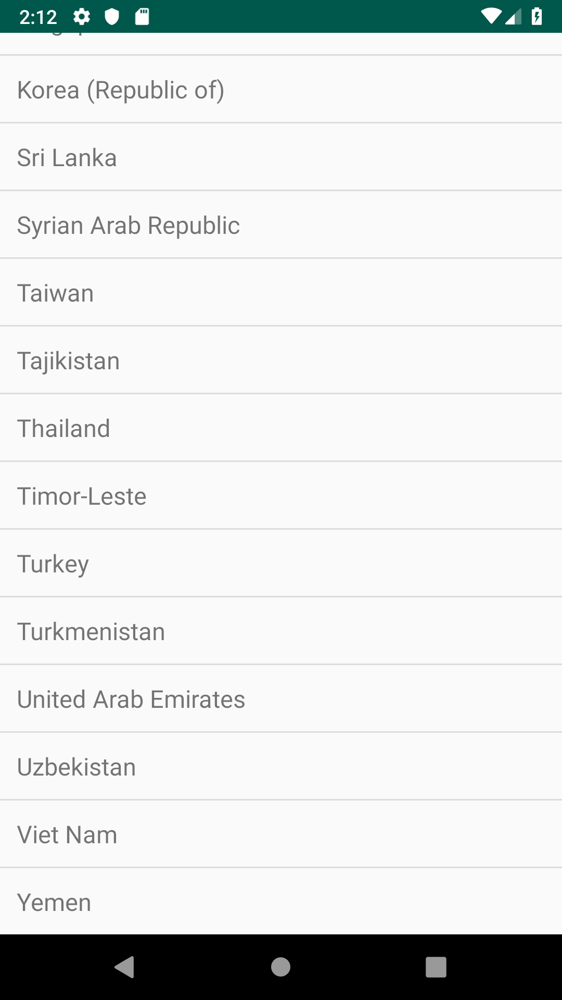
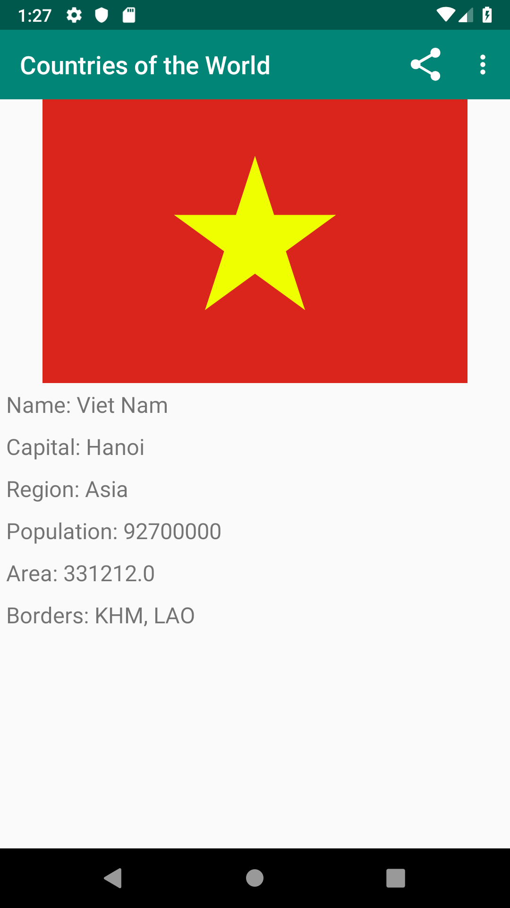
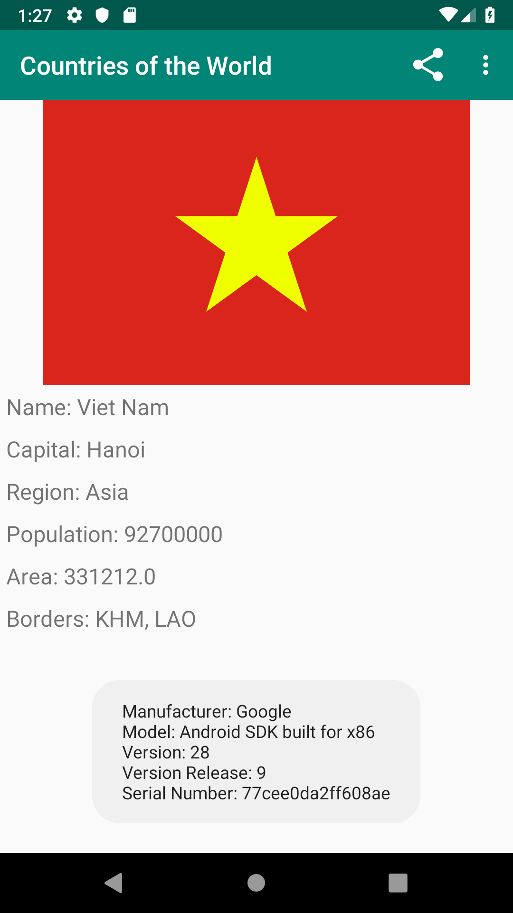
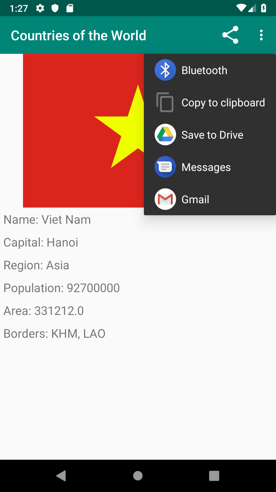

# countries_of_the_world
Countries of the world is an android application that reads a JSON dataset from a URL (https://restcountries.eu/rest/v2/all) allowing the user to browse the countries of the world based on continents and regions. This application demonstrates the use of liseteners, adapters, listview controls, Asynctask objects, JSON and is made with Java on Android studio. The user is also able to share data using the shareActionProvider class. This was a group project by Chris Truong and Kevin Chow

Screenshots:

  

    

